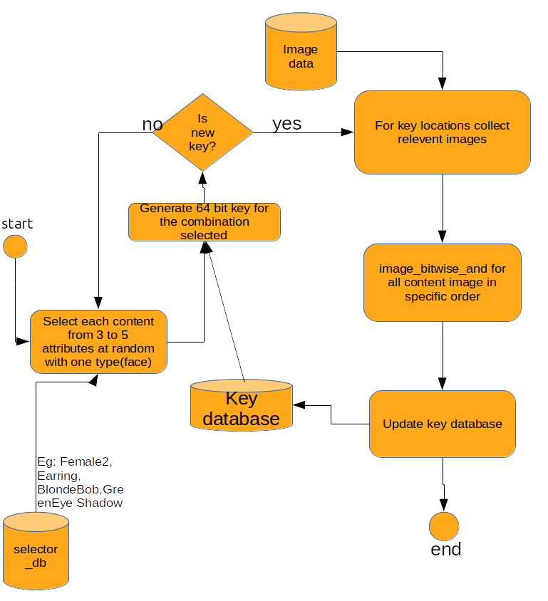

---
Cryptopunk and Meebit alike NFT Art Generator
   written by: Udit Sangule([*uditsangule@gmail.com*](mailto:uditsangule@gmail.com)[)]()
-----------------------------------------------------

Introduction:
=============

CryptoPunks are 24x24 pixel art images, generated
algorithmically,whereas the Meebits are 3D voxels characters. Each and
every punk has their own profile page that shows their attributes as
well as their ownership/for-sale status. Once the characeter are
generated ,each character then are registered on Etherium blockchain.

We can generate these unique characters alogrithmically by applying two
approaches:

1.  Computer Vision Naive Method.

2.  Machine Learning Generative Neural Networks.

Before Discussing these methods , some important concepts should to be
understood before applying these approach.

Concept \#1 Deciding Attributes and Archetypes:
===============================================

The basic building block of an NFT art are the face/(head in Meebits) or
say basic Archetype being generated.To make these archetype unique or
different we add attributes or features to these faces and we get
enumerous combinations out of it. We will name it *selector\_database*
as it will contain all the possible list we are adding into images.

For eg – Punks contain:

-   Types : \['Male', 'Female', 'Zombie', 'Ape', 'Alien'\]

-   Attributes : \['Hat', 'Hair', 'Eyes', 'Blemishes', 'Nose', 'Ears',
    'Mouth', 'Beard', 'Neck'\]

Concept \#2 Deciding Key bits and calculations:
===============================================

So the Attributes and types are decided, follow these steps:

1.  Add Contents of each attributes and types in sorted order. (I have
    written a python script to create this csv data from README given by
    cryptopunks in Appendix).

2.  Take a count on all availabe attributes and type then assign length
    of bits required to assign each attribute feature selected.

    Note: you need to take max bits and also some room for future
    content introduction, the extra\_selector\_bits ( lets take +2 extra
    for each attribute).

```selector_bits = math.ceil( log2(total_count_per_attribute) ) + (extra_selector_bits)```

```max_bits += selector_bits```

    For punks:

    Type contains unique files :11 with min bits\_req=4

    Hat contains unique files :19 with min bits\_req=5

    Hair contains unique files :35 with min bits\_req=6

    Eyes contains unique files :27 with min bits\_req=5

    Blemishes contains unique files :6 with min bits\_req=3

    Nose contains unique files :2 with min bits\_req=1

    Ears contains unique files :2 with min bits\_req=1

    Mouth contains unique files :14 with min bits\_req=4

    Beard contains unique files :12 with min bits\_req=4

    Neck contains unique files :5 with min bits\_req=3

So,

36 bits needed for image key generation.

You can assign more bits to add more attribute list in future. So lets
take key bits to be:

**Generator\_key = 64 bits (8 extra + (36 required + (2 \*10
extra\_selector\_bits) )**

1.  Assign the bit locations for each attributes in key with reference
    to future bits.
 ------- ------ ----- ------ ------ --------- ------ ------ ------- ------- ------
  Key\_bits (in order) =
  |Extra | Type | Hat | Hair | Eyes | Belmish | Nose | Ears | Mouth | Beard | Neck |
  |------|------|-----|------|------|---------|------|------|-------|-------|------|
  |  8   |  6   |  7  |  8   |  7   |   5     |  3   |   3  |   6   |  6    |  5   |
  ------- ------ ----- ------ ------ --------- ------ ------ ------- ------- ------

The generator\_key has been designed to generate each image a unique
pixel combination. While generating an image we assign a key to it. So
that no new image will get same generator key.Some combinations will be
discarded as it doesnt contains value.

With the current available data we can generate almost **\~ 68 Billion**
(2^36) images. And if we have sufficient attributes to fill all bits,
we can generate **2 x 10^19** unique images.

Now, Lets take a look at the methods to generate !

Method \#1 Compute Vision:
==========================

This method require images data of all the types and attributes in same
image-resolution (28x28) pixels like cyberpunks made available on
github([*link*](https://github.com/cryptopunksnotdead/punks.blocks)).

Flow chart:
-----------



 Algoritm:
----------

1.  Select one type from selector database and one from random
    attributes (such as: Hat , Hair , Eyes , Nose) upto 7 attributes. (
    Note: sequential selection is also accepted , instead of random)

2.  Generate corresponding key for the selected combination with
    Generate\_key Algorithm.

    1.  Check if key is already taken ? i.e if such combination is
        already generated.

        1.  If yes , then search again for the combination until a new
            unique key combination is generated.

        2.  If No, we are good to proceed for the generation.

3.  For each attribute selected , take the corresponding 24x24 image out
    of image dataset and perform:

    1.  Add the image layers into a black image (np.zeros(24,24)) in to
        order:

        1.  type > attr1 > attr2 > attr3 > and so on....

4.  update the key\_database with registered key , so that current image
    couldnt be generated again in future.

5.  Save the image (punk1.png) and attributes (punk\_attr.csv) into
    system.

6.  Go to step no 1 for next generation.


References:
===========

-   Official Git Repository :
    [*https://github.com/cryptopunksnotdead*](https://github.com/cryptopunksnotdead)

-   CyberPunks official site :
    [*https://www.larvalabs.com/cryptopunks*](https://www.larvalabs.com/cryptopunks)

-   meebits official site :
    [*https://meebits.larvalabs.com/*](https://meebits.larvalabs.com/)

-   Text to Image Gans research paper :
    [*http://proceedings.mlr.press/v48/reed16.pdf*](http://proceedings.mlr.press/v48/reed16.pdf)
